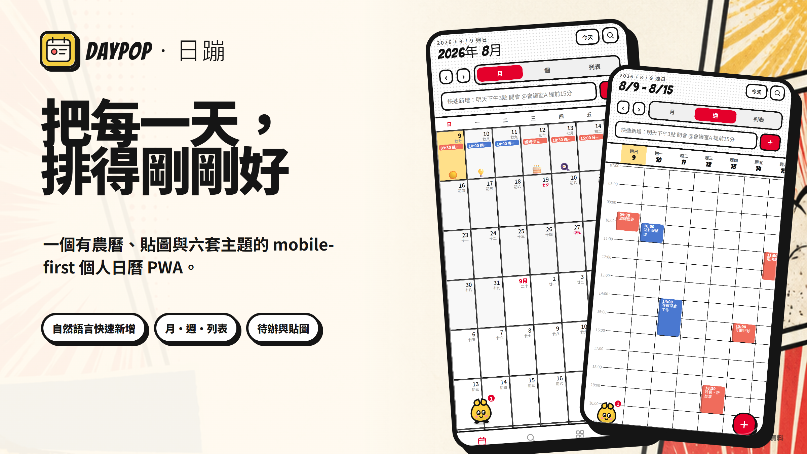
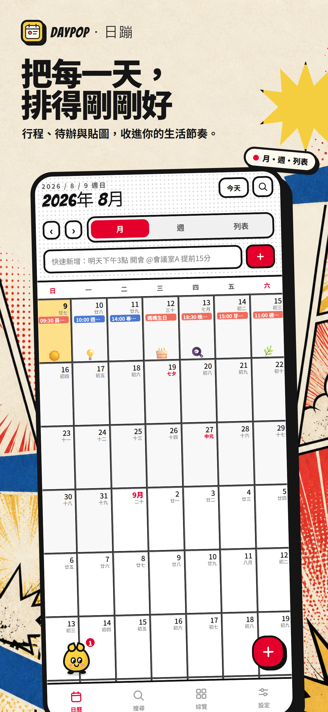
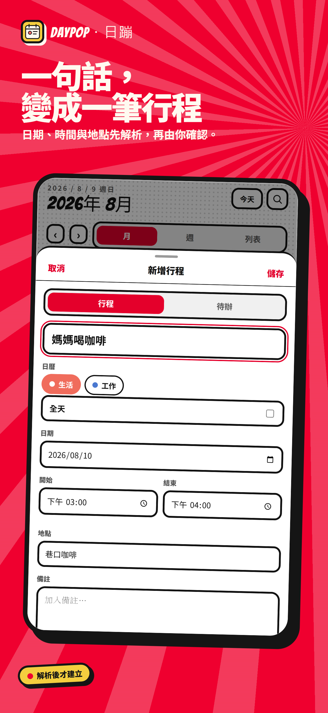
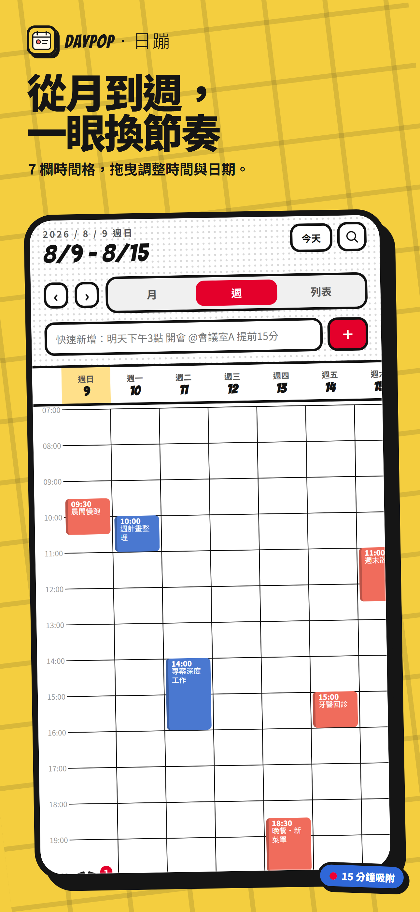
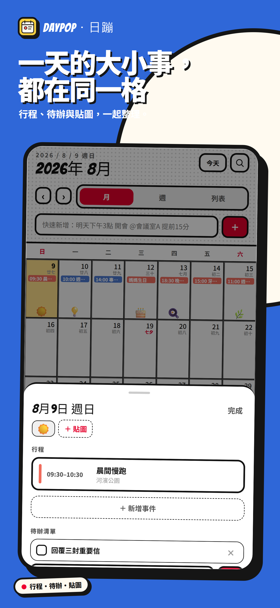
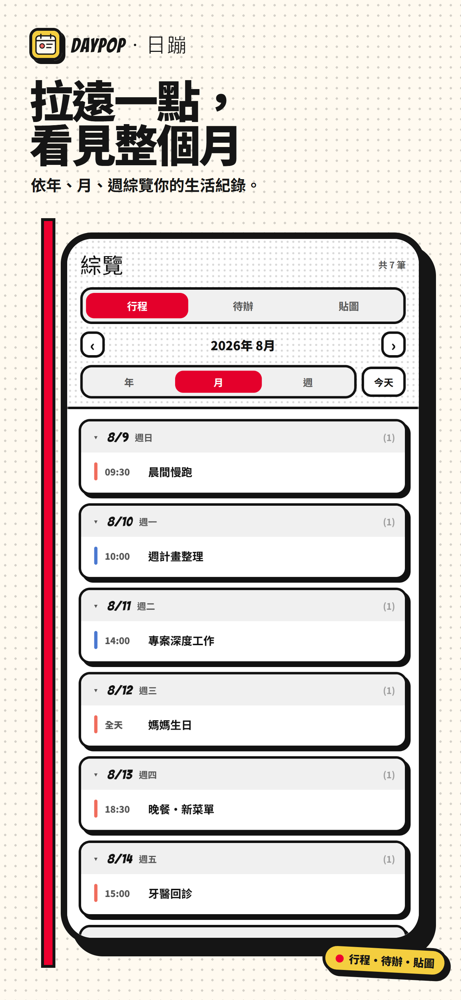
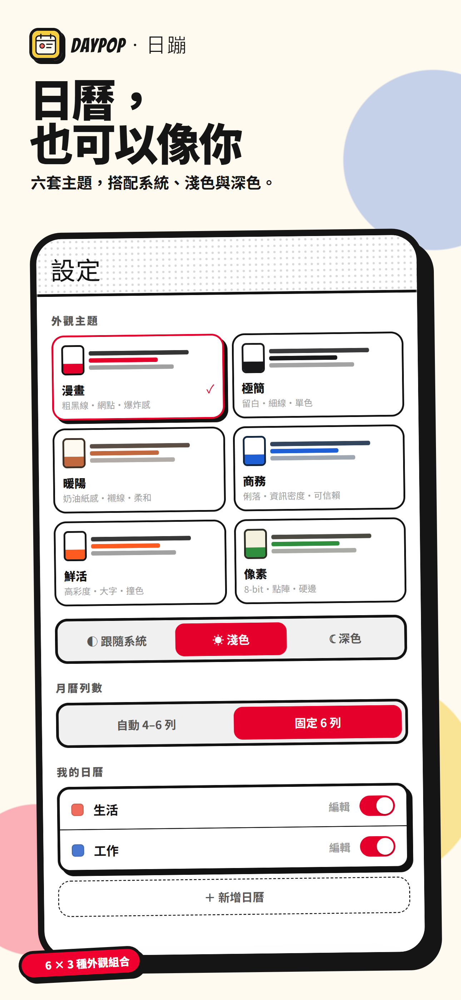

# 日蹦 DayPop

DayPop 是以手機為主的個人日曆 PWA。目前正在把 Claude Design 匯出的完整多頁原型，依原設計漸進搬移成 React + TypeScript + Vite 的可維護產品；行程、待辦、貼圖、主題、Supabase Auth、帳號資料保存、舊資料匯入與私人附件均已接入，正式 hosting、Google OAuth provider 與行動裝置驗收仍在發布路徑上。



## 產品亮點

以下是以目前 App 真實介面與隔離合成資料製作的 App Store 風格展示；`1290×2796` 直式構圖符合 Apple 目前列出的 6.9 吋 iPhone screenshot 尺寸之一，但不表示 DayPop 已提交或上架 App Store。完整 campaign、主張依據與 QA 紀錄位於 [`showcase/`](showcase/manifest.json)。

<p align="center">
  
  
  
</p>
<p align="center">
  
  
  
</p>

## 目前可用

- 日曆分頁：連續捲動的月格（可保存自動 4–6 列或固定六列）、7 欄時間格週檢視、列表檢視，以及今天與前後期
- 週檢視可拖曳改時間、拖曳邊緣調整長度、橫向拖曳換日，皆吸附 15 分鐘
- 點日期開啟日詳情 sheet；新增、編輯與刪除行程
- 快速新增自然語言解析日期、時間與地點，解析結果交給事件表單確認後才建立；讀到目前存不下來的重複／提醒會明講，不靜靜丟掉
- 事件表單可設定日曆、全天、日期、起訖時間、地點與備註
- 新增、完成與刪除待辦
- 日詳情可貼上貼圖（63 個 emoji），月格依當日數量自動縮放，綜覽可依區間統計
- 多個日曆：新增、改名、換色與顯示切換；顏色套用到所有檢視，搜尋可依日曆篩選
- 搜尋分頁與綜覽分頁（行程／待辦切換、年／月／週期間）
- 六套可保存的外觀主題 × 跟隨系統／淺色／深色、農曆與節日標示、App 內浮動寵物
- 版本檢查、更新內容公告與使用者選擇更新
- 版本化的本機資料格式；讀不出來或來自較新版本時拒絕覆寫並進入復原流程
- 瀏覽器無法保存資料時降級為本分頁記憶體模式，並持續顯示不可關閉的警告
- mobile-first PWA manifest、service worker 與基本 App shell 啟動快取
- Email＋密碼註冊／登入、忘記／重設密碼、session restore 與遊客模式
- 登入後以 Supabase 保存行程、待辦、貼圖、偏好與私人附件；遊客資料與帳號資料保持隔離
- 舊 `calpet.v2` 資料可先預覽、確認後原子匯入，成功、失敗與重試都不刪除原始資料
- Supabase migrations、10 張公開資料表、owner-only RLS、private Storage bucket 與產生的 TypeScript database types

日曆、搜尋與綜覽三個分頁已依原始 Claude Design 逐段搬移並以 Playwright 並排比對；設定分頁的外觀主題與日曆管理已搬移，其餘區塊與其他 dialog 仍待搬移（DP-014）。原稿中沒有真正能力的部分（天氣、雲端同步狀態、AI）一律停用並保留版面位置，不以假的成功狀態充數；貼圖與登入帳號的私人附件已分別接上真實資料。`日曆桌寵 Calendar Pet.dc.html`、generated `support.js` 與 `寵物素材規範 Pet Asset Spec.md` 共同作為搬移依據；正式功能不在 generated runtime 上繼續堆疊。設計優先序與頁面範圍見 [Claude Design 設計基準](docs/claude-design-source-of-truth.md)，功能狀態見 [原型行為與設計保全清單](docs/prototype-behavior-baseline.md)。

## 本機開發

需要 Node.js 24（major 版本以 `.nvmrc` 為準，`package.json` 的 `engines` 宣告同一範圍）與 npm 11 以上。使用 nvm 的話可先 `nvm use`。

```bash
npm install
npm run dev
```

品質檢查：

```bash
npm run lint
npm run typecheck
npm run test
npm run build
npm run check:build   # 需先 build：檢查建置輸出沒有遠端依賴且帶有 CSP
```

## 持續整合

PR 與 `main` 的 push 會由 GitHub Actions（`.github/workflows/ci.yml`）執行 `npm ci`，再依序跑上面四項檢查，並以 mobile／desktop Chromium 執行 Playwright e2e；Node 版本直接讀 `.nvmrc`，與本機一致。CI 目前不需要任何環境變數或密鑰，Supabase 未設定時 build 仍可通過。日後若某個步驟需要密鑰，只能使用 GitHub Secrets 注入，不得寫進 workflow 或 repository。部署 workflow 使用的兩個 Supabase 值放在 repository **variables** 而不是 secrets —— 它們依設計是公開的，一定會進到前端 bundle。Supabase `db reset`／pgTAP CI 仍未納入。

Production preview：

```bash
npm run preview
```

## 部署

Staging 為 GitHub Pages 專案站台。部署由 `.github/workflows/deploy-staging.yml` 以人工 `workflow_dispatch` 觸發（不掛在 push 上），先跑與 PR 相同的品質閘門，再以絕對 base path 建置後發布。

子路徑部署必須用絕對 base，否則 Supabase 的 auth redirect 會掉回網域根目錄：

```bash
npm run build -- --base=/DayPop/
```

`postbuild` 會把 `dist/index.html` 複製成 `dist/404.html`，讓靜態主機對未知路徑仍能啟動 App 並保留原網址。

**尚未部署**：開啟 Pages、設定兩個 repository variables、Supabase redirect allowlist 與觸發部署都是專案擁有者的人工設定。完整流程、rollback 與部署後驗收清單見 [`docs/deployment.md`](docs/deployment.md)。

## Supabase 開發

複製 `.env.example` 為 `.env.local`，只填入 project URL 與 publishable key。前端不需要、也不得使用 secret／`service_role` key。沒有 Supabase 設定時 App 仍可使用遊客模式，但登入按鈕會停用並顯示原因。

官方 CLI 已固定為 project dev dependency：

```bash
npm run supabase:start
npm run supabase:reset
npm run supabase:test
npm run supabase:types
npm run supabase:stop
```

本機 Supabase stack／reset／database test 需要 Docker-compatible runtime。若要對已連結的 preview／staging 專案驗證，可先執行 `npx supabase link --project-ref <project-ref>`，再使用：

```bash
npm run supabase:test:linked
npm run supabase:types:linked
```

正式 schema 以 `supabase/migrations/` 為準；目前 migrations 已套用到 DayPop 遠端專案，並通過 owner RLS、帳號刪除 cascade 測試與 Supabase security advisor。不要對有正式資料的專案執行 remote reset。

Email Auth 已啟用且需要信箱驗證。Google provider 尚未在 Supabase Dashboard 啟用，因此 UI 會提示先使用 Email；完成 Google OAuth client 與 redirect allowlist 設定後，App 會從公開 Auth settings 偵測並顯示 Google 登入按鈕。

## 版本發布方式

1. 更新 `package.json` 的 `version`。
2. 在 `release-notes.json` 新增同版本的公告內容，最新版本放第一筆；版本正式部署後，該版公告不再修改。
3. 執行 `npm run build`；prebuild 會產生 `public/version.json` 與含版本 cache 名稱的 `public/sw.js`。
4. 部署 `dist/`。使用者開啟 App、回到前景、恢復連線或手動檢查時會取得不快取的 `version.json`，看到更新內容後可選擇立即更新或稍後提醒。

Service worker 只清理由 DayPop 管理、且帶有 `daypop-app-shell-` 前綴的舊 App cache。它不操作 `localStorage` 或 IndexedDB。

## 安裝圖示

`public/icons/daypop.svg` 是圖案本身的唯一來源，`public/icons/*.png` 是 `npm run icons` 由它產生並提交的結果：

```bash
npm run icons   # 改過 daypop.svg 後重新產生 PNG，並把結果一起提交
```

一共三種取景：manifest 的 `any`（192／512，保留圓角與透明角落）、`maskable`（192／512，滿版底色＋縮到 80% 安全區，讓 Android 可裁成圓形或方圓形）、以及 `apple-touch-icon-180.png`（滿版且完全不透明，因為 iOS 會忽略 SVG、把透明處填成黑色並自行套用圓角）。`npm run check:build` 會核對建置輸出的尺寸、宣告與不透明度。

## 資料安全邊界

- 新 React App 暫時以 `daypop.user-data` 保存帶 `schemaVersion` 的遊客資料。
- 資料讀不出來或來自較新的 schema 時 fail closed：拒絕所有寫入，改顯示復原畫面，並要求先備份成功才開放重設。原始位元組在備份前不會被取代。
- `localStorage` 不可用（無痕視窗、封鎖網站資料）或中途寫入被拒（`QuotaExceededError`）時，只降級為本分頁的記憶體模式，並以不可關閉的橫幅持續告知內容不會保存；降級後不會自動切回。
- 舊原型的 `calpet.v2` 不會被覆寫或刪除；正式匯入流程會另案實作並在成功前保留原資料。
- 不呼叫 `localStorage.clear()`，也不因 App 版本更新重設行程或偏好。
- Supabase 前端只允許 project URL 與 publishable key；不得放入 `service_role` 或其他伺服器密鑰。這兩個值依設計是公開的，會被打包進 bundle。
- production build 不含任何執行期第三方依賴：`default-src 'self'` 的 CSP 在建置期產生並注入 `index.html`，`connect-src` 只額外允許該次建置的 Supabase origin。`npm run check:build` 會擋下新的遠端依賴或遺失的 CSP，CI 每次都跑。meta 形式的 CSP 無法涵蓋 `frame-ancestors`，選定 hosting 後應再以 response header 補上。
- 登入／登出不會自動上傳、清除或改綁目前的遊客資料；舊資料匯入必須先預覽與確認，失敗可回復且不刪除原始 `calpet.v2`。

登入完成後，`SessionDataProvider` 會依 user id 選擇 authenticated adapter，Supabase 是 durable store；同帳號版本化快取只在短暫遠端讀取失敗時顯示並持續警告。所有畫面都經 `src/data` 的 repository 合約存取資料，不直接呼叫 browser storage 或 Supabase。這不代表即時跨裝置同步：遠端寫入失敗不會自動重送，多裝置衝突合併與完整離線寫入佇列仍不在 MVP 範圍。

## 專案結構

```text
src/domain/       核心資料型別、日期邏輯、共用領域編輯、農曆、快速新增解析與時間格計算
src/data/         UI 唯一依賴的 repository 合約、DataProvider 與 Supabase adapter
src/theme/        六套 canonical 主題 token、ThemeProvider 與自託管字體清單
src/shell/        App viewport、safe area、底部四分頁、桌面手機展示框與跨分頁橫幅
src/screens/      各分頁畫面；calendar/ 是依原稿搬移的日曆
src/hooks/        跨畫面共用的 React hooks
src/auth/         Supabase Auth provider、狀態與登入介面
src/lib/          公開環境設定、Supabase client 與產生的 DB types
src/storage/      瀏覽器儲存存取、版本化本機資料與 repository
src/pwa/          版本檢查、更新提示與 service worker client
pwa/              service worker 來源模板
scripts/          release assets 產生器
public/           manifest、icon 與產生後的 release assets
docs/             原型行為、架構決策與審查交接文件
supabase/         CLI config、migrations 與本機 seed
```

跨模組設計見 [架構決策](docs/architecture-decisions.md)，後續工作與資料架構見 [tasks.md](tasks.md)。接手 Supabase 階段前請先讀 [Supabase MCP 階段交接](docs/supabase-mcp-handoff.md)。
