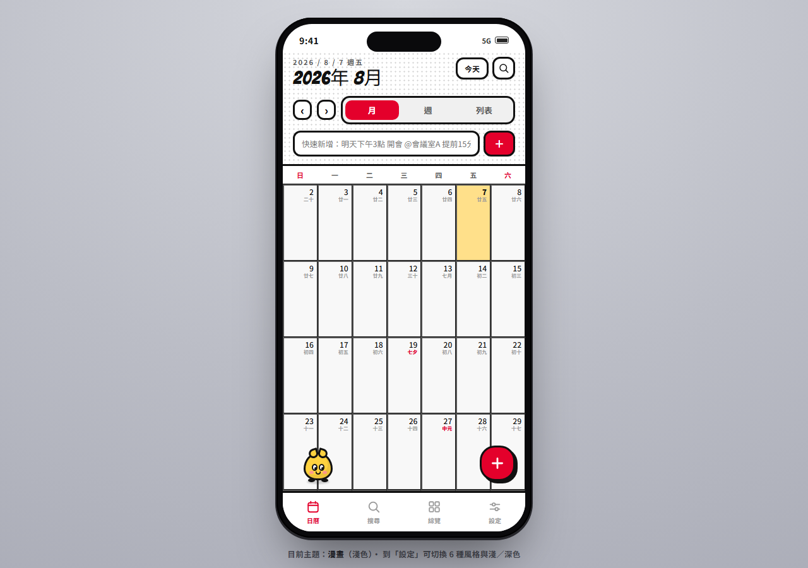
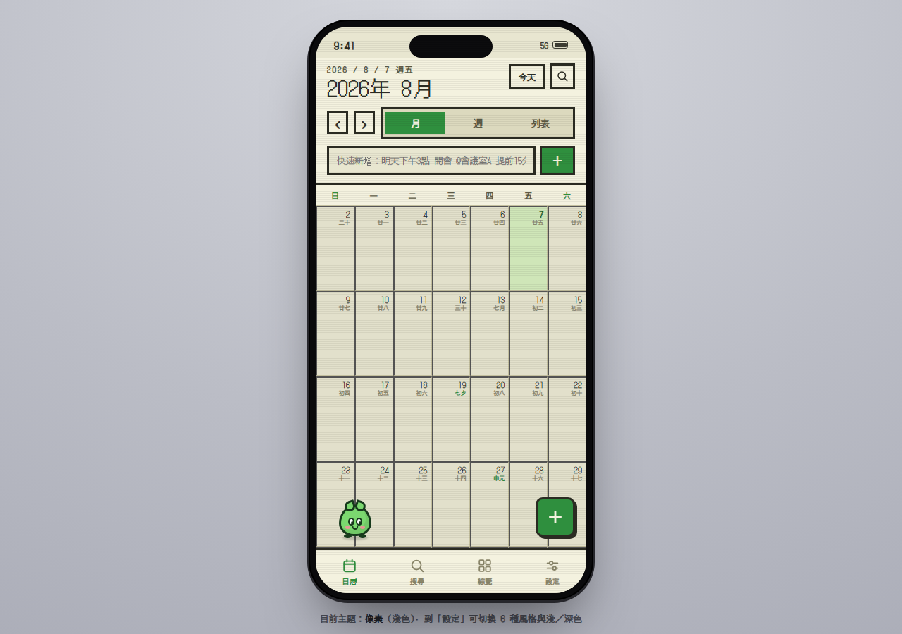
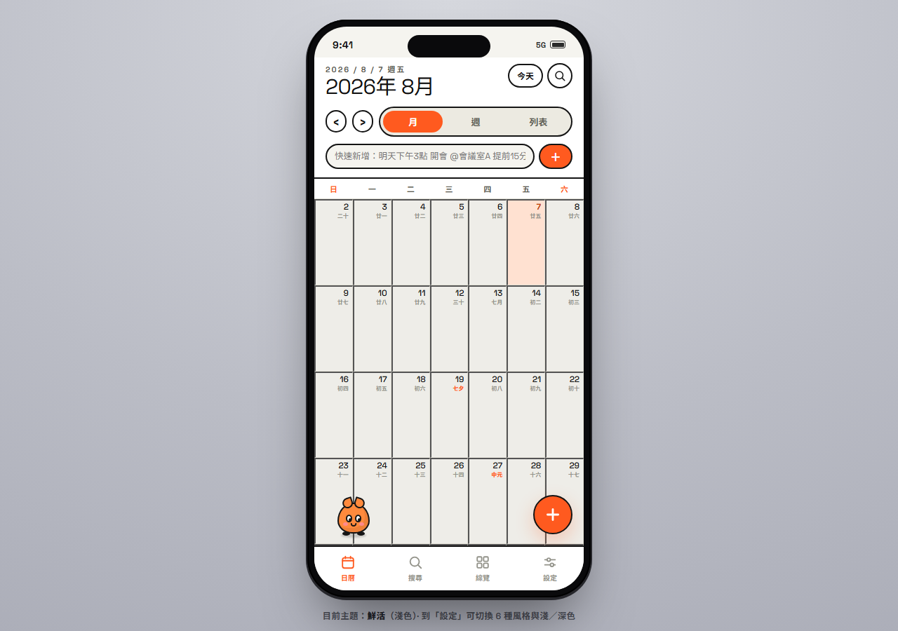

# 日蹦 DayPop

DayPop 是以手機為主的個人日曆 PWA。目前正在把 Claude Design 匯出的完整多頁原型，依原設計漸進搬移成 React + TypeScript + Vite 的可維護產品；Supabase Auth 與資料庫安全基礎已接入，帳號日曆 CRUD／匯入仍是下一階段。

## 畫面

> 實機截圖，`npm run dev` 後拍攝。日曆本身不需要登入或 Supabase 設定即可操作。



月檢視：連續捲動的月格，附農曆與節日（七夕、中元等），今日高亮，
上方是月／週／列表切換與自然語言快速新增。

六套外觀主題 × 淺／深色，於「設定」即時切換：

| 像素 | 鮮活 |
|---|---|
|  |  |

## 目前可用

- 日曆分頁：連續捲動的月格、7 欄時間格週檢視、列表檢視，以及今天與前後期
- 週檢視可拖曳改時間、拖曳邊緣調整長度、橫向拖曳換日，皆吸附 15 分鐘
- 點日期開啟日詳情 sheet；新增、編輯與刪除行程
- 快速新增自然語言解析日期與時間；讀到目前存不下來的重複／地點／提醒會明講，不靜靜丟掉
- 新增、完成與刪除待辦
- 搜尋分頁與綜覽分頁（行程／待辦切換、年／月／週期間）
- 六套外觀主題 × 淺／深色、農曆與節日標示、App 內浮動寵物
- 版本檢查、更新內容公告與使用者選擇更新
- 版本化的本機資料格式；讀不出來或來自較新版本時拒絕覆寫並進入復原流程
- 瀏覽器無法保存資料時降級為本分頁記憶體模式，並持續顯示不可關閉的警告
- mobile-first PWA manifest、service worker 與基本 App shell 啟動快取
- Email＋密碼註冊／登入、忘記／重設密碼、session restore 與遊客模式
- Supabase migrations、9 張核心表、owner-only RLS 與產生的 TypeScript database types

日曆、搜尋與綜覽三個分頁已依原始 Claude Design 逐段搬移並以 Playwright 並排比對；設定分頁除外觀主題外的其餘區塊與其他 dialog 仍待搬移（DP-014）。原稿中沒有真正能力的部分（天氣、貼圖、附件、雲端同步狀態、AI）一律停用並保留版面位置，不以假的成功狀態充數。`日曆桌寵 Calendar Pet.dc.html`、generated `support.js` 與 `寵物素材規範 Pet Asset Spec.md` 共同作為搬移依據；正式功能不在 generated runtime 上繼續堆疊。設計優先序與頁面範圍見 [Claude Design 設計基準](docs/claude-design-source-of-truth.md)，功能狀態見 [原型行為與設計保全清單](docs/prototype-behavior-baseline.md)。

## 本機開發

需要 Node.js 24（major 版本以 `.nvmrc` 為準，`package.json` 的 `engines` 宣告同一範圍）與 npm 11 以上。使用 nvm 的話可先 `nvm use`。

```bash
npm install
npm run dev
```

品質檢查：

```bash
npm run lint
npm run typecheck
npm run test
npm run build
```

## 持續整合

PR 與 `main` 的 push 會由 GitHub Actions（`.github/workflows/ci.yml`）執行 `npm ci`，再依序跑上面四項檢查；Node 版本直接讀 `.nvmrc`，與本機一致。CI 目前不需要任何環境變數或密鑰，Supabase 未設定時 build 仍可通過。日後若某個步驟需要密鑰，只能使用 GitHub Secrets 注入，不得寫進 workflow 或 repository。Supabase `db reset`／pgTAP 與 Playwright e2e 會隨 DP-033／DP-030 再加入。

Production preview：

```bash
npm run preview
```

## Supabase 開發

複製 `.env.example` 為 `.env.local`，只填入 project URL 與 publishable key。前端不需要、也不得使用 secret／`service_role` key。沒有 Supabase 設定時 App 仍可使用遊客模式，但登入按鈕會停用並顯示原因。

官方 CLI 已固定為 project dev dependency：

```bash
npm run supabase:start
npm run supabase:reset
npm run supabase:test
npm run supabase:types
npm run supabase:stop
```

本機 Supabase stack／reset／database test 需要 Docker-compatible runtime。若要對已連結的 preview／staging 專案驗證，可先執行 `npx supabase link --project-ref <project-ref>`，再使用：

```bash
npm run supabase:test:linked
npm run supabase:types:linked
```

正式 schema 以 `supabase/migrations/` 為準；目前 migrations 已套用到 DayPop 遠端專案，並通過 owner RLS、帳號刪除 cascade 測試與 Supabase security advisor。不要對有正式資料的專案執行 remote reset。

Email Auth 已啟用且需要信箱驗證。Google provider 尚未在 Supabase Dashboard 啟用，因此 UI 會提示先使用 Email；完成 Google OAuth client 與 redirect allowlist 設定後，App 會從公開 Auth settings 偵測並顯示 Google 登入按鈕。

## 版本發布方式

1. 更新 `package.json` 的 `version`。
2. 在 `release-notes.json` 新增同版本的公告內容，最新版本放第一筆；版本正式部署後，該版公告不再修改。
3. 執行 `npm run build`；prebuild 會產生 `public/version.json` 與含版本 cache 名稱的 `public/sw.js`。
4. 部署 `dist/`。使用者開啟 App、回到前景、恢復連線或手動檢查時會取得不快取的 `version.json`，看到更新內容後可選擇立即更新或稍後提醒。

Service worker 只清理由 DayPop 管理、且帶有 `daypop-app-shell-` 前綴的舊 App cache。它不操作 `localStorage` 或 IndexedDB。

## 資料安全邊界

- 新 React App 暫時以 `daypop.user-data` 保存帶 `schemaVersion` 的遊客資料。
- 資料讀不出來或來自較新的 schema 時 fail closed：拒絕所有寫入，改顯示復原畫面，並要求先備份成功才開放重設。原始位元組在備份前不會被取代。
- `localStorage` 不可用（無痕視窗、封鎖網站資料）或中途寫入被拒（`QuotaExceededError`）時，只降級為本分頁的記憶體模式，並以不可關閉的橫幅持續告知內容不會保存；降級後不會自動切回。
- 舊原型的 `calpet.v2` 不會被覆寫或刪除；正式匯入流程會另案實作並在成功前保留原資料。
- 不呼叫 `localStorage.clear()`，也不因 App 版本更新重設行程或偏好。
- Supabase 前端只允許 project URL 與 publishable key；不得放入 `service_role` 或其他伺服器密鑰。
- 登入／登出不會自動上傳、清除或改綁目前的遊客資料；帳號匯入會另做可預覽、可確認、失敗可回復的流程。

目前登入只建立安全 session；介面會明確提示帳號資料 CRUD 尚未接線，避免把「已登入」誤解成「已同步」。

## 專案結構

```text
src/domain/       核心資料型別、日期邏輯、農曆、快速新增解析與時間格計算
src/theme/        六套 canonical 主題 token、ThemeProvider 與自託管字體清單
src/shell/        App viewport、safe area、底部四分頁、桌面手機展示框與跨分頁橫幅
src/screens/      各分頁畫面；calendar/ 是依原稿搬移的日曆
src/hooks/        跨畫面共用的 React hooks
src/auth/         Supabase Auth provider、狀態與登入介面
src/lib/          公開環境設定、Supabase client 與產生的 DB types
src/storage/      瀏覽器儲存存取、版本化本機資料與 repository
src/pwa/          版本檢查、更新提示與 service worker client
pwa/              service worker 來源模板
scripts/          release assets 產生器
public/           manifest、icon 與產生後的 release assets
docs/             原型行為、架構決策與審查交接文件
supabase/         CLI config、migrations 與本機 seed
```

跨模組設計見 [架構決策](docs/architecture-decisions.md)，後續工作與資料架構見 [tasks.md](tasks.md)。
